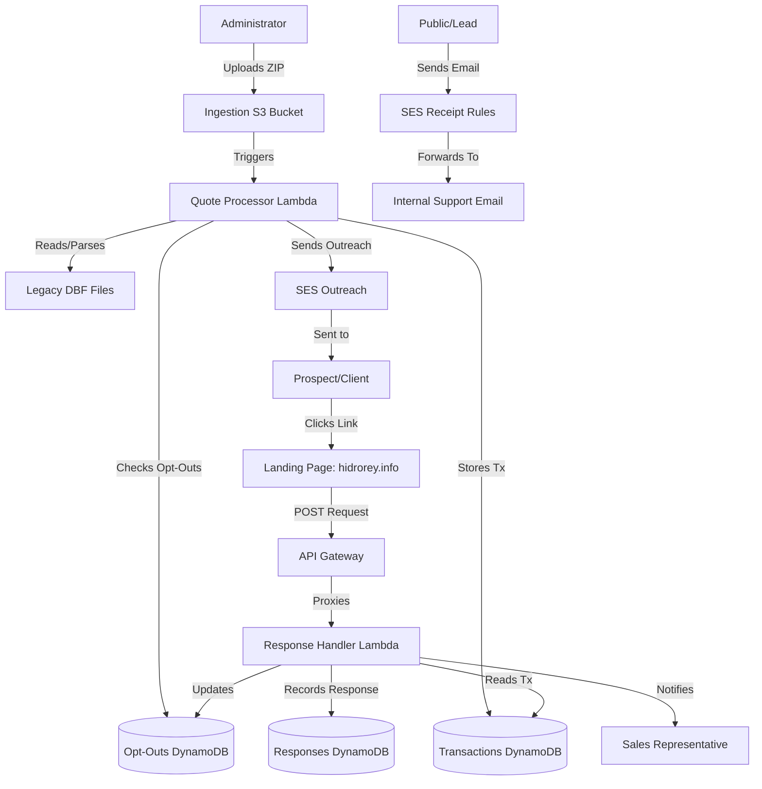

# High-Level System Overview

## Introduction

The **CRM Infrastructure** system is an automated platform designed to streamline the sales follow-up process. Its primary function is to digest legacy quote data (from DBF files), manage communication cadences with prospects and clients, and track their responses via a web interface.

## Core Objectives

1.  **Automated Ingestion**: Seamlessly ingest and parse legacy quote data uploaded to the cloud.
2.  **Intelligent Filtering**: Apply business rules (allowlists, cadence schedules, opt-outs) to determine which prospects should receive follow-up emails.
3.  **Engagement Tracking**: Capture user responses ("Buy", "More Info", "Not Interested", "Opt Out") from email links and store them for analysis.
4.  **Sales Loop Closure**: Automatically notify sales representatives when a prospect interacts with a quote.
5.  **Customer Support Continuity**: Forward incoming inquiries from the public domain to the internal support team.

## System Architecture

The system is built entirely on **AWS Serverless** architecture using the AWS Cloud Development Kit (CDK).

### High-Level Diagram

## Key Subsystems

### 1. Ingestion & Processing Pipeline
*   **Role**: Converts raw data into actionable communication.
*   **Mechanism**: Listens for file uploads, parses proprietary DBF formats, and filters quotes based on strict business logic (time-since-creation, explicit allowlists, and opt-out status).

### 2. API & Response Handling
*   **Role**: The "listening" ear of the system.
*   **Mechanism**: A RESTful API that accepts feedback from prospects. It correlates the response with the original email transaction to provide context to the sales team and handles opt-out requests.

### 3. Frontend Landing Page
*   **Role**: The user interface for prospects.
*   **Mechanism**: A static website hosted on S3 and distributed via CloudFront with a custom domain (`hidrorey.info`), providing a fast and secure endpoint for users to submit their interest.

### 4. Email Communication & Forwarding
*   **Role**: Manages outbound and inbound email flows.
*   **Mechanism**: Uses Amazon SES for automated outreach and notification. A custom receipt rule set handles incoming emails to the public domain, forwarding them to the internal team.

## Technology Stack

*   **Infrastructure as Code**: AWS CDK (TypeScript).
*   **Compute**: AWS Lambda (Python 3.13/3.11).
*   **Storage**: AWS S3 (Files), AWS DynamoDB (Data).
*   **Networking**: AWS API Gateway, Amazon CloudFront, Route 53.
*   **Communication**: Amazon SES (Outbound & Receipt Rules).
*   **Language**: Python (Backend logic), TypeScript (Infrastructure).
